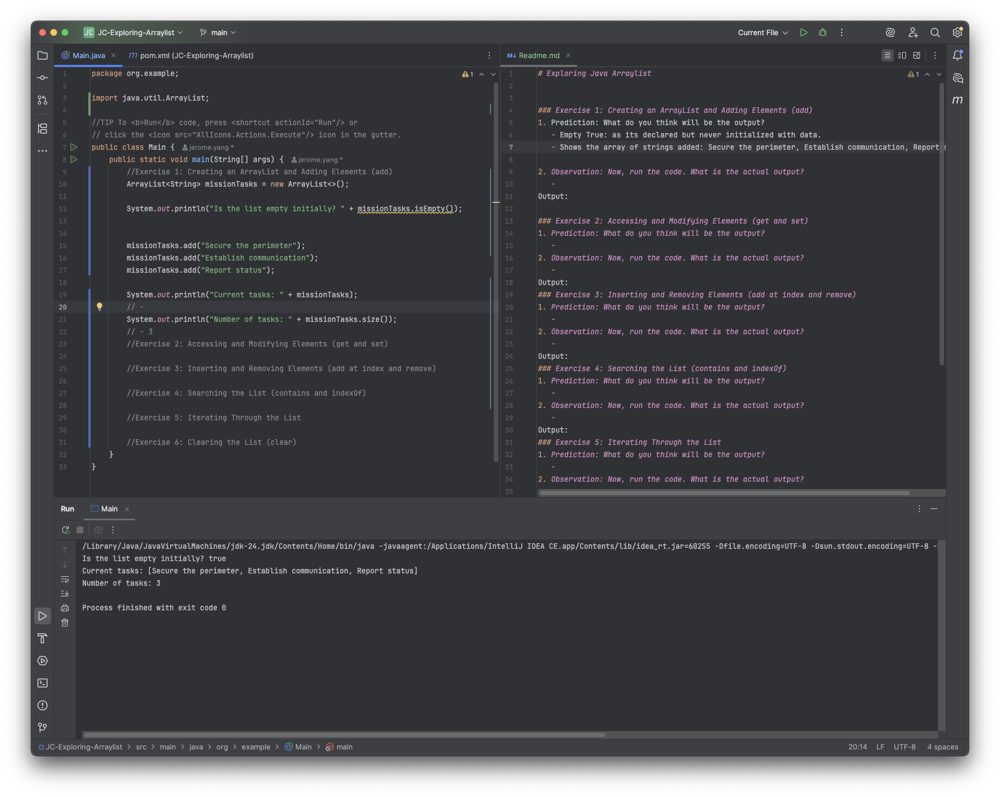
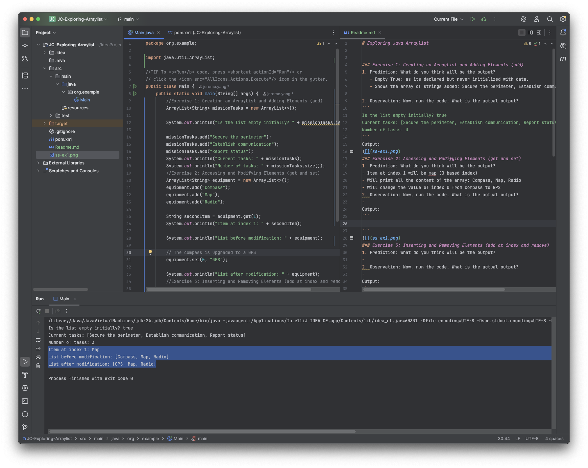
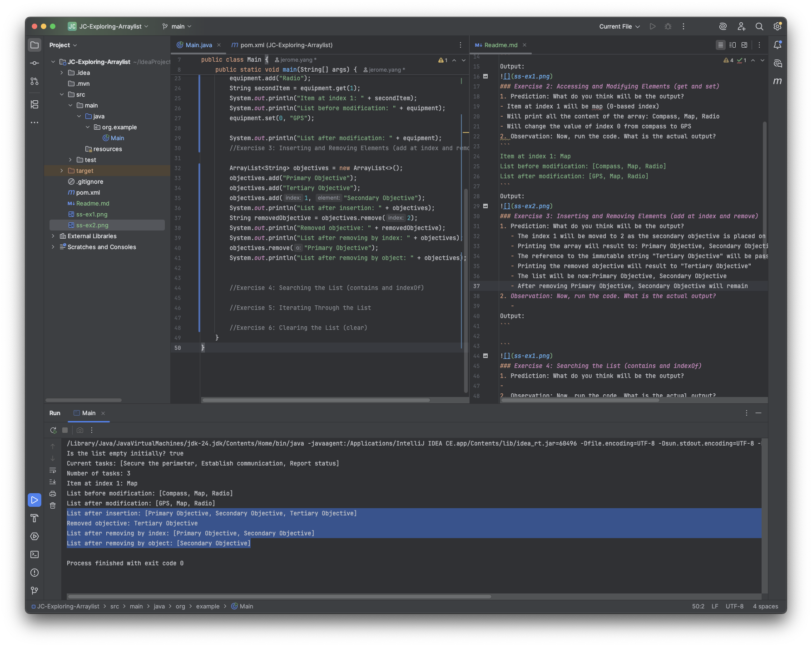
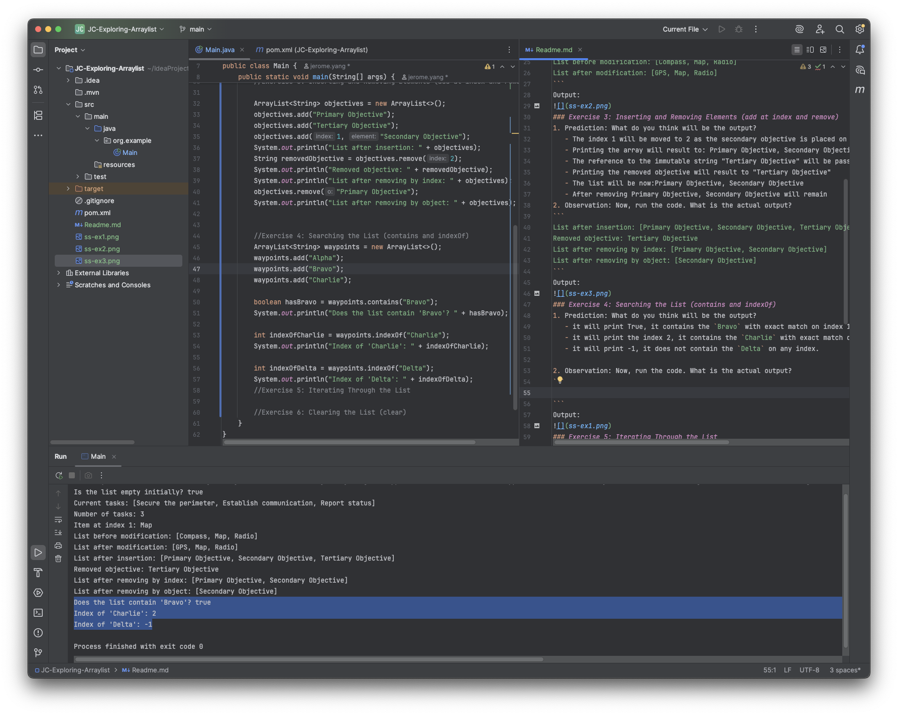
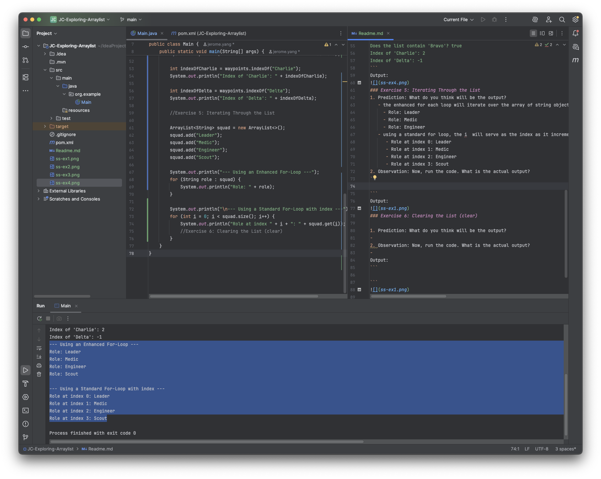
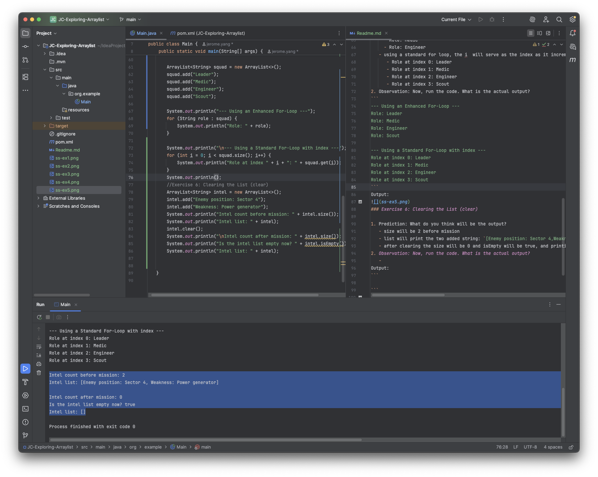

# Exploring Java Arraylist


### Exercise 1: Creating an ArrayList and Adding Elements (add)
1. Prediction: What do you think will be the output?
   - Empty True: as its declared but never initialized with data.
   - Shows the array of strings added: Secure the perimeter, Establish communication, Report status

2. Observation: Now, run the code. What is the actual output?
```
Is the list empty initially? true
Current tasks: [Secure the perimeter, Establish communication, Report status]
Number of tasks: 3
```
Output:

### Exercise 2: Accessing and Modifying Elements (get and set)
1. Prediction: What do you think will be the output?
- Item at index 1 will be map (0-based index)
- Will print all the content of the array: Compass, Map, Radio
- Will change the value of index 0 from compass to GPS
2. Observation: Now, run the code. What is the actual output?
```
Item at index 1: Map
List before modification: [Compass, Map, Radio]
List after modification: [GPS, Map, Radio]
```
Output:

### Exercise 3: Inserting and Removing Elements (add at index and remove)
1. Prediction: What do you think will be the output?
   - The index 1 will be moved to 2 as the secondary objective is placed on the first index(it was previously placed there)
   - Printing the array will result to: Primary Objective, Secondary Objective, Tertiary Objective
   - The reference to the immutable string "Tertiary Objective" will be passed to the removedObjective object
   - Printing the removed objective will result to "Tertiary Objective"
   - The list will be now:Primary Objective, Secondary Objective
   - After removing Primary Objective, Secondary Objective will remain
2. Observation: Now, run the code. What is the actual output? 
```
List after insertion: [Primary Objective, Secondary Objective, Tertiary Objective]
Removed objective: Tertiary Objective
List after removing by index: [Primary Objective, Secondary Objective]
List after removing by object: [Secondary Objective]
```
Output:

### Exercise 4: Searching the List (contains and indexOf)
1. Prediction: What do you think will be the output?
   - it will print True, it contains the `Bravo` with exact match on index 1
   - it will print the index 2, it contains the `Charlie` with exact match on index 2
   - it will print -1, it does not contain the `Delta` on any index.

2. Observation: Now, run the code. What is the actual output?
```
Does the list contain 'Bravo'? true
Index of 'Charlie': 2
Index of 'Delta': -1
```
Output:

### Exercise 5: Iterating Through the List
1. Prediction: What do you think will be the output?
   - the enhanced for each loop will iterate over the array of string objects and print its value with "Role: {value}"
     - Role: Leader
     - Role: Medic
     - Role: Engineer
   - using a standard for loop, the i  will serve as the index as it increments with the iteration and stop on the condition that it never meet the actual size of the squad (zero-based index)
      - Role at index 0: Leader
      - Role at index 1: Medic
      - Role at index 2: Engineer
      - Role at index 3: Scout 
2. Observation: Now, run the code. What is the actual output?
```
--- Using an Enhanced For-Loop ---
Role: Leader
Role: Medic
Role: Engineer
Role: Scout

--- Using a Standard For-Loop with index ---
Role at index 0: Leader
Role at index 1: Medic
Role at index 2: Engineer
Role at index 3: Scout
```
Output:

### Exercise 6: Clearing the List (clear)

1. Prediction: What do you think will be the output?
   - size will be 2 before mission
   - list will print the two added string: `[Enemy position: Sector 4,Weakness: Power generator]`
   - after clearing the size will be 0 and isEmpty will be true, and printing an empty array will be `[]`
2. Observation: Now, run the code. What is the actual output?
```
Intel count before mission: 2
Intel list: [Enemy position: Sector 4, Weakness: Power generator]

Intel count after mission: 0
Is the intel list empty now? true
Intel list: []
```
Output:

